

  <h1> School Management System User's Manual</h1>
 
  Group Members: Phyo Wai Kyaw, Thin Ei San
   
  <small> 21, July, 2021</small>
  

## Table of Contents
- [Project Overview](#project-overview)
- [Custom Module Installation](#custom-module-installation)
- [Operation](#operation)
    - [Create Data](#create-data)
    - [Add Data into Sections](#add-data-into-sections)
    - [Create Attendance](#create-attendance)
    - [Monthly Report](#monthly-report)
    - [Create Exam Questions](#create-exam-questions)
    - [Test Exam and Generate Result](#test-exam-and-generate-result)

## Projcet Overview
School management system is very convenient for checking students' roll-call percentage and also useful  for saving attendance records for each student and for testing exams. 
    Functions of the system:
- Manage attendance
- Test Exam

## Custom Module Installation
To run this system you need to install our custom module in odoo version 15. By clicking install button you can easily access this system.

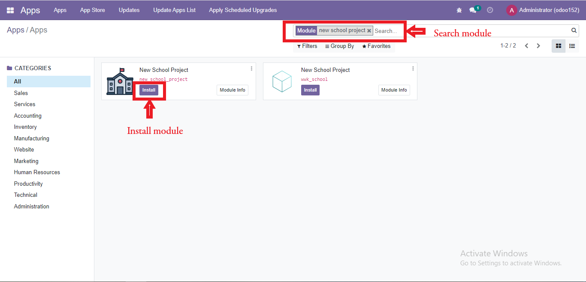

## Operation

### Create Data
Go To ***School*** main menu and click create button to create new data.

Choose role like teacher or student. If teacher, you can select teacher role like principal, teacher and teacher head. 
Create new student
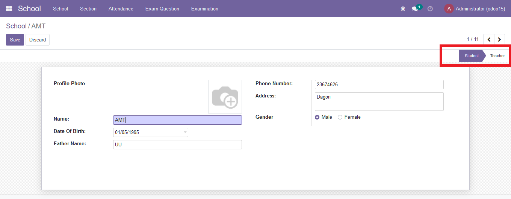

Create new teacher

Can see same role in a collection by chosing these menuitems and options
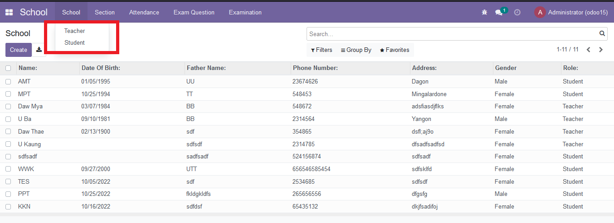

### Add Data into Sections
To create new section go to ***Section*** menu. A section can have one teacher head, many teachers and many students.
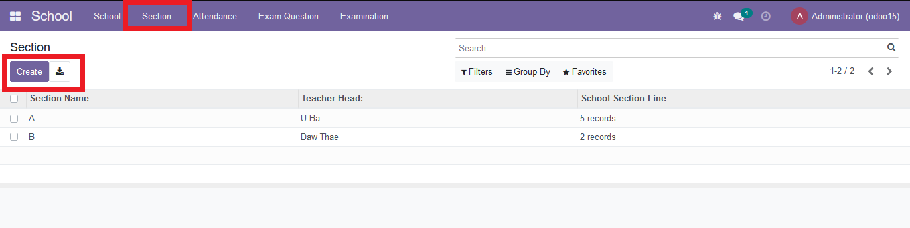
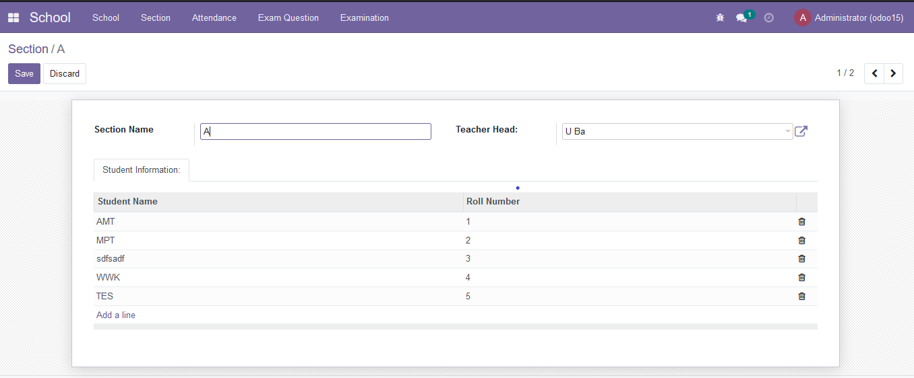

### Create Attendance
For creating new attendance record Go to > Attendance > Roll call. 

### Monthly Report
Go to > Attendance > Monthly Report to view monthly attendance of each section
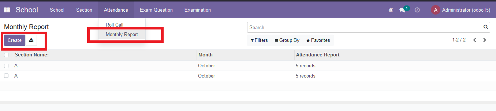
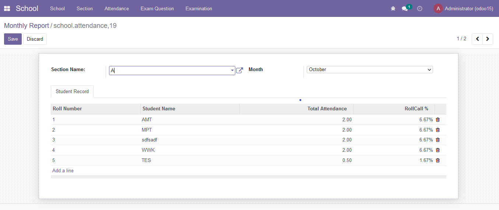

### Create Exam Questions
Go to ***Exam Question*** menu, write questions and define correct answers.Can hide some questions that do not want to show in exam form view by removing check mark  in the active column .
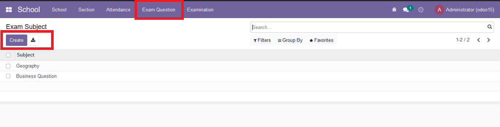
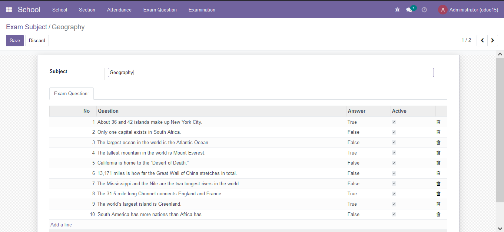
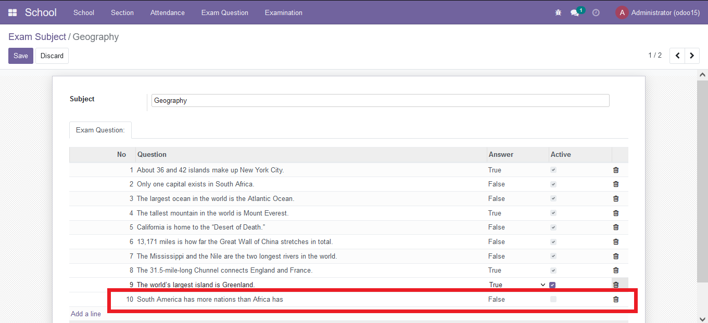

### Test Exam and Generate Result
To answer exam questions go to ***Examination*** menu and choose subject. Students whose roll-call precentage is at least 75% can answer exam.
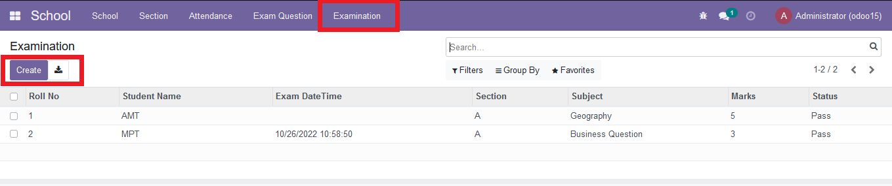
After selecting course, you can answer questions. And then, click submit button to see your result.

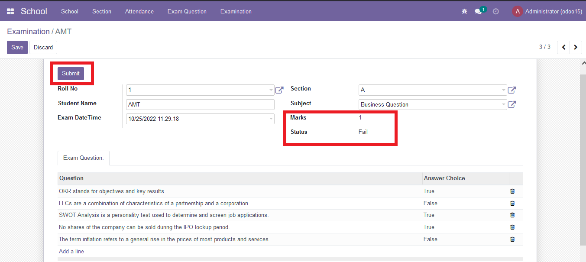